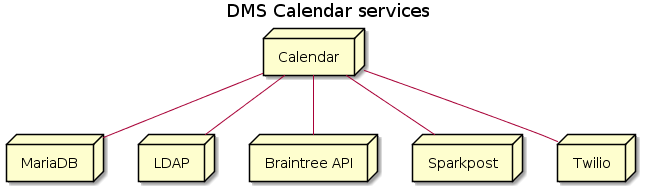
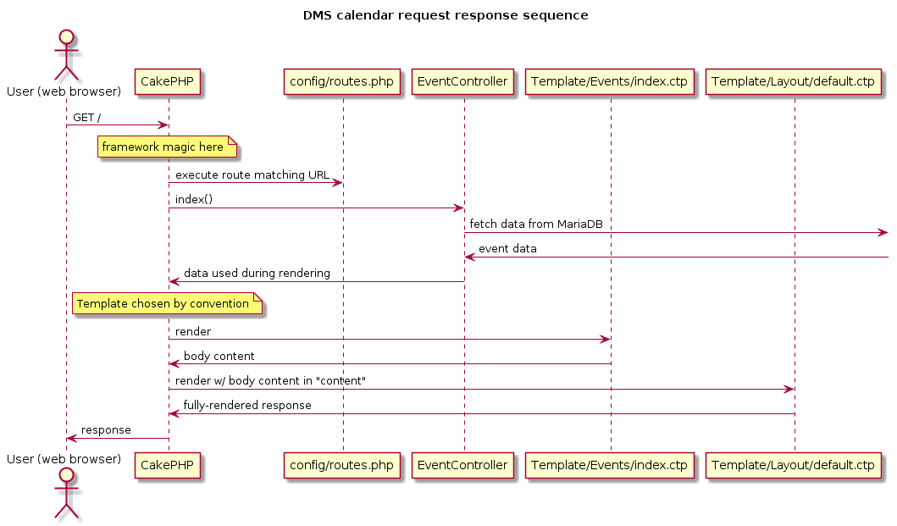

# App design docs

This provides an overview of how the calendar works.

## Services

DMS calendar communicates with:

* MariaDB: holds persistent data (e.g. calendar events, attendees, etc.); MySQL-compatible database server
* DMS Active Directory (LDAP): connects the calendar to DMS accounts used across DMS's other services; account / authentication server
* Braintree: credit card processesing; third-party service
* Twilio: sends SMS notifications; third-party service
* Sparkpost: sends email notifications? third-party service

## Webserver

The webserver is [HHVM](https://docs.hhvm.com/hhvm/getting-started/getting-started) and it uses Proxygen internally - you can think of these as a wrapper around CakePHP that handles low-level stuff like managing parallel requests, network connections, etc. 

I believe the webserver just invokes [/index.php](/index.php) with each request, and that triggers all the CakePHP framework magic; however, I didn't look into this too much.

## Application

The app is built with CakePHP, which is a pretty typical [MVC](https://en.wikipedia.org/wiki/Model%E2%80%93view%E2%80%93controller) framework with [CRUD](https://en.wikipedia.org/wiki/Create,_read,_update_and_delete)-centric route handling.

Key files:

* /index.php - entrypoint for everything
* config/bootstrap.php - global setup type stuff
* config/routes.php - URL-to-Controller mappings
* src/ - all the core business logic for the calendar and associated UI markup

Here's how a response is computed:

More details on the rest can be found at [CakePHP](https://book.cakephp.org/) - [request cycle](https://book.cakephp.org/3/en/intro.html#cakephp-request-cycle) and [controllers request flow](https://book.cakephp.org/3/en/controllers.html#request-flow) are especially helpful.

**Warning:** check [/composer.json](/composer.json) to ensure you're looking at docs for the right version of CakePHP.

