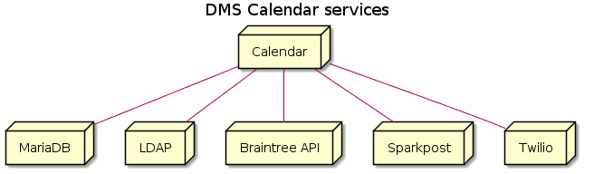
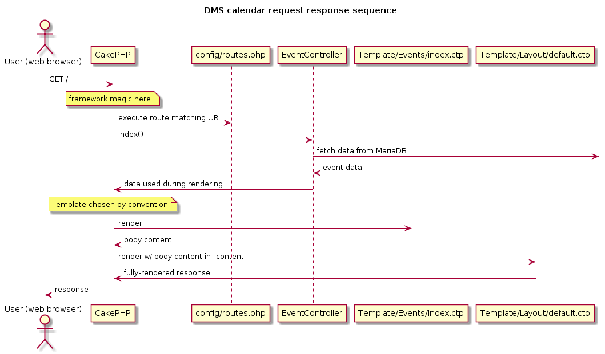

# App design docs

This provides an overview of how the calendar works.


## Services



DMS calendar communicates with:

* MariaDB: holds persistent data (e.g. calendar events, attendees, etc.); MySQL-compatible database server
* DMS Active Directory (LDAP): connects the calendar to DMS accounts used across DMS's other services; account / authentication server
* Braintree: credit card processesing; third-party service
* Sparkpost: sends email notifications? third-party service
* Twilio: sends SMS notifications; third-party service


## Webserver

The webserver is one of:

* Production: [Apache](https://httpd.apache.org/) and [PHP-FPM](https://www.php.net/manual/en/install.fpm.php) for calendar.dallasmakerspace.org. If you run locally without Docker, you might also be using these.


You can think of these as wrappers around CakePHP that handle low-level stuff like managing parallel requests, network connections, etc. They just invoke [index.php](../index.php) with each request. This activates the CakePHP framework, and eventually the calendar code under [src/](../src/) is invoked (see next section).


## Application

The app is built with CakePHP, which is a pretty typical [MVC](https://en.wikipedia.org/wiki/Model%E2%80%93view%E2%80%93controller) framework with [CRUD](https://en.wikipedia.org/wiki/Create,_read,_update_and_delete)-centric route handling.

Key files:

* [index.php](../index.php) - entrypoint for everything
* [config/bootstrap.php](../config/bootstrap.php) - global setup type stuff
* [config/routes.php](../config/routes.php) - URL-to-Controller mappings
* [src/](../src/) - all the core business logic for the calendar and associated UI markup

Here's how a response is computed:



More details on the rest can be found at [CakePHP](https://book.cakephp.org/) - [request cycle](https://book.cakephp.org/3/en/intro.html#cakephp-request-cycle) and [controllers request flow](https://book.cakephp.org/3/en/controllers.html#request-flow) are especially helpful.

**Warning:** check [composer.json](../composer.json) to ensure you're looking at docs for the right version of CakePHP.


## Tests

Tests live alongside the code in [src/](../src/), not under `tests/TestCase/`. [phpunit.xml.dist](../phpunit.xml.dist) is configured to discover anything matching `*Test.php` in `./src`. Run the suite under Docker:

```
docker compose exec -w /var/www app vendor/bin/phpunit --no-coverage
```

### Test datasource

[tests/bootstrap.php](../tests/bootstrap.php) registers a dedicated `test` connection by reading the `default` config from [config/app.default.php](../config/app.default.php) and appending `-test` to the database name. Fixtures `TRUNCATE` the tables they manage, so the suite is careful never to run against your dev database — only against the derived `<dbname>-test` schema on the same host.

**Production guardrail:** the bootstrap refuses to start if the resolved `default` host isn't on a small allowlist (`localhost`, `127.0.0.1`, `::1`, `db` — the docker-compose service name in [docker-compose.yml](../docker-compose.yml)). This stops `vendor/bin/phpunit` from doing any damage if `DB_HOST` is misconfigured to point at the prod RDS instance. If you legitimately need to run tests against another host, edit the allowlist in `tests/bootstrap.php`.

### CI

[.github/workflows/test.yml](../.github/workflows/test.yml) runs the full PHPUnit suite on every push and pull request against a MariaDB 10.11 service container. CI uses `DB_HOST=127.0.0.1`, which is on the allowlist above.
